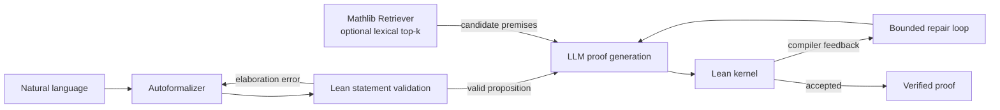

# LeanProofAgent

**A Lean-verified mathematical reasoning agent with compiler-guided repair and
lightweight Mathlib premise retrieval.**

LeanProofAgent is a small, reproducible research system for natural-language
autoformalization and proof generation with local language models. Models may
propose statements and proofs, but only the pinned Lean kernel can mark a proof
as verified.

## Motivation

Language models can produce plausible mathematical arguments that contain
invalid syntax, nonexistent library APIs, or subtle proof gaps. LeanProofAgent
turns those failures into explicit signals: every candidate is checked in Lean,
the exact compiler error can be returned to the model for a bounded repair, and
all attempts are saved for inspection.

The project asks a deliberately narrow question:

> Can compiler feedback and lightweight premise retrieval improve verifiable
> mathematical reasoning for small local language models?

It is a small-scale experimental system, not a state-of-the-art theorem prover.

## Core idea

1. Generate one Lean theorem statement from natural language.
2. Reject unsafe output and ask Lean to elaborate the statement as a proposition.
3. Generate a proof and check it with `lake env lean`.
4. On failure, return the exact Lean diagnostic for a bounded repair attempt.
5. Optionally retrieve a small deterministic list of local Mathlib declarations
   and include their real names and signatures in the proof prompt.
6. Persist the configuration, attempts, diagnostics, latency, token usage when
   reported by the provider, and final result.

## Architecture



The **Lean kernel is the final proof-correctness trust boundary**. Python code,
model output, retrieval ranking, and tactics are outside that boundary.

**Lean proof correctness is not natural-language semantic correctness.** A
kernel-accepted proof establishes the generated Lean proposition, not that the
proposition faithfully captures every assumption or ambiguity in the source
text. Bidirectional implication search is an auxiliary signal; unsuccessful
search remains `unknown`.

## Features

- Lean 4 and Mathlib pinned to `v4.34.0`.
- Bounded proof generation and compiler-feedback repair.
- Natural-language autoformalization with safety, elaboration, and `Prop` checks.
- Conservative Lean-checked bidirectional implication testing.
- Local Ollama and optional OpenAI backends behind one protocol.
- Deterministic lexical Mathlib premise retrieval with real declaration checks.
- Theorem and autoformalization benchmarks, saved-run comparison, and regression
  analysis.
- JSON and Markdown artifacts with attempts, errors, latency, and provider token
  usage when available.
- Offline mock-model demos that still use the real Lean toolchain.

The project intentionally has no vector database, embedding service, web UI,
multi-agent orchestration, fine-tuning, or benchmark-specific proof lookup.

## Installation

Requirements: Python 3.11+, Git, and
[Elan](https://github.com/leanprover/elan). Clone the repository and run:

```bash
git clone https://github.com/hguitar762-bit/LeanProofAgent.git
cd LeanProofAgent
lake update
lake exe cache get
python -m venv .venv
python -m pip install -e ".[dev]"
lake build
pytest
```

Activate the environment with `.venv\Scripts\Activate.ps1` on Windows or
`source .venv/bin/activate` on Linux/macOS. Install `.[openai,dev]` only if the
optional OpenAI backend is needed; local Ollama use requires no paid API.

## Quick Start

Run the complete offline demonstration. The mock model deliberately produces an
invalid formalization and an invalid proof; real Lean errors drive both repairs:

```bash
python examples/mock_autoformalization_demo.py
```

Without activating the virtual environment on Windows, invoke its interpreter
directly: `.venv\Scripts\python.exe examples\mock_autoformalization_demo.py`.

For a local model:

```bash
ollama pull qwen3:4b
lean-proof solve-text \
  "For every natural number n, n plus zero equals n." \
  --name natural_add_zero \
  --backend ollama \
  --model qwen3:4b
```

Premise retrieval is opt-in and defaults to at most ten declarations:

```bash
lean-proof solve \
  --benchmark add_zero \
  --backend ollama \
  --model qwen3:4b \
  --premise-retrieval \
  --premise-top-k 10
```

The retrieved name, type signature, source module, and score are saved in the
run's `premises.json`.

## Example

The offline demo follows this sequence:

```text
For every natural number n, n plus zero equals n.
  → rejected statement: theorem ... : ℕ
  → Lean feedback: declaration type is not a proposition
  → repaired statement: theorem ... (n : ℕ) : n + 0 = n
  → rejected proof: by exact 0
  → Lean type error returned to the model
  → repaired proof: by omega
  → Lean-verified
```

Mock outputs are fixed workflow fixtures, not benchmark results. Production
success always uses the same real Lean verification path.

## Evaluation

The formal benchmark contains 18 frozen problems: easy, medium, and hard cases
from arithmetic, algebra, logic, inequalities, sets, and functions. Its directory
SHA-256 is
`7ac68ea1e8fbad111763bf1b0b508253d91aa7a50bfccbc2879157ed7dc7f3d7`.
Runs use at most three formalization attempts, three proof attempts, and two
equivalence attempts per direction.

Important metrics are final Lean-verified rate, first-pass success, repair gain,
failure signals, attempts, latency, and provider-reported tokens. Missing usage
is reported as unavailable or a lower bound, never estimated.

See [REPORT.md](REPORT.md) for the complete setup and analysis,
[EXPERIMENTS.md](EXPERIMENTS.md) for reproduction commands, and
[experiments/](experiments/) for versioned reports and the frozen manifest.

## Experimental Results

### Model comparison

Local Ollama defaults, identical prompts and limits, one run per model on the
18-problem benchmark:

| Metric | qwen3:4b | qwen3:8b |
| --- | ---: | ---: |
| Final formalization success | 16/18 (88.9%) | 17/18 (94.4%) |
| First-pass proof success | 3/18 (16.7%) | 3/18 (16.7%) |
| Final Lean-verified success | 5/18 (27.8%) | 6/18 (33.3%) |
| Proof repair gain | +2 (+11.1 pp) | +3 (+16.7 pp) |
| End-to-end latency | 7,083.47 s | 7,934.87 s |

The 8B model showed an observed gain of one verified problem, with three gains
and two regressions. On only 18 paired cases this is not evidence of a reliable
or statistically significant model-size improvement, and 8B took 12.0% longer.

### Mathlib retrieval ablation

qwen3:4b, Ollama defaults, fixed top-k 10, same benchmark and attempt limits:

| Metric | Baseline | Retrieval |
| --- | ---: | ---: |
| First-pass proof success | 3/18 (16.7%) | 3/18 (16.7%) |
| Final Lean-verified success | 5/18 (27.8%) | 7/18 (38.9%) |
| Proof repair gain | +2 (+11.1 pp) | +4 (+22.2 pp) |
| Proof-stage Lean/API hallucination | 13/42 (31.0%) | 6/37 (16.2%) |
| End-to-end latency | 7,083.47 s | 8,309.55 s |
| Verified regressions | — | 3 |

This is an **observed improvement**, not a statistically significant claim.
Retrieval gained five cases and lost three, for a net +2/18, while latency rose
17.3%. It reduced invented API names but increased use of real yet incompatible
lemmas. It remains an optional experimental method rather than the v1.0 default.

## Failure Analysis

The dominant bottleneck is proof generation after a statement already passes
Lean. Observed failures include:

- fenced or explanatory text instead of a statement or proof term;
- nonexistent Mathlib declarations and tactics;
- real lemmas applied with incompatible arguments or types;
- tactic failures and unresolved goals;
- formalizations rejected under `set_option autoImplicit false`;
- lexical retrieval returning irrelevant type- or domain-specific premises;
- stochastic regressions where another condition had verified the same problem;
- equivalence proof search ending in `unknown`.

The retrieval run cut proof-stage hallucination signals but shifted some errors
toward wrong-lemma application. This is why verified results, regressions, and
raw Lean feedback matter more than one aggregate rate.

## Limitations

- The formal benchmark has only 18 problems and one stochastic run per main
  condition.
- Local model outputs and latency have substantial run-to-run variance.
- Bounded equivalence proof search is incomplete and is not full semantic
  validation.
- Lexical retrieval can return irrelevant premises and caused regressions.
- No model was trained or fine-tuned by this project.
- No reported improvement is claimed to be statistically significant.
- Provider token totals are lower bounds when a failed call reports no usage.
- LeanProofAgent is not a state-of-the-art or general-purpose theorem prover.

## Reproducibility

The repository pins Lean/Mathlib, versions the frozen benchmark manifest and
summary reports, and records the exact Git commit, benchmark hash, model,
attempt limits, generation overrides, toolchain, and timeout in experiment
configs. To reproduce the local setup:

```bash
ollama pull qwen3:4b
ollama pull qwen3:8b
lake build
pytest
python examples/mock_autoformalization_demo.py
```

The exact baseline and retrieval commands are in [EXPERIMENTS.md](EXPERIMENTS.md).
Do not compare runs unless prompts, attempt limits, Lean/Mathlib, benchmark hash,
and model-generation configuration match. Raw model artifacts are local and
ignored; compact reports and manifests are versioned.

## Roadmap

Future research may study type-aware premise filtering, proof-state-aware search,
theorem embeddings, larger replicated benchmarks, trained theorem-proving
models, and stronger human-centered semantic evaluation. These are future-work
directions, not v1.0 features.

## License

[MIT](LICENSE)
